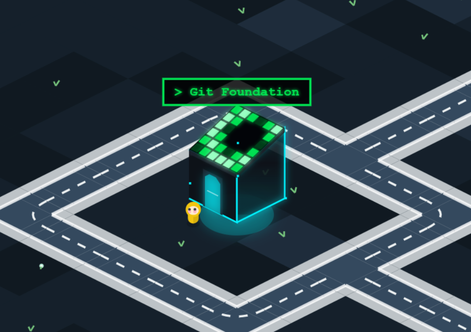
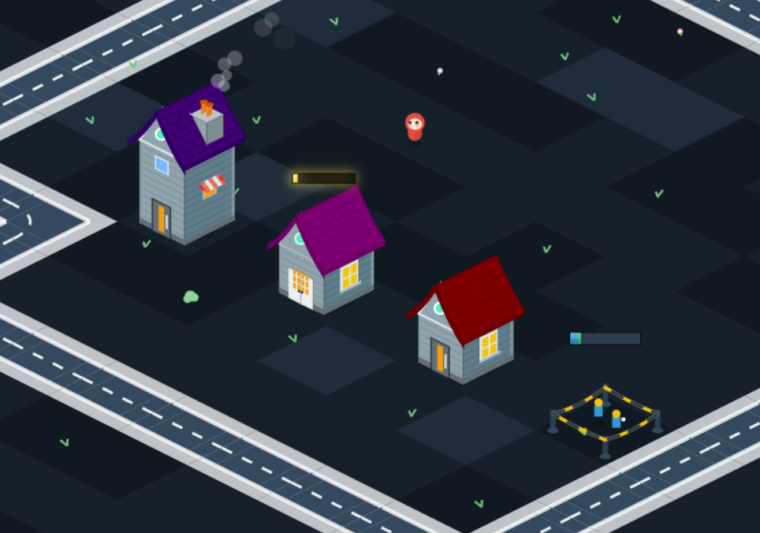
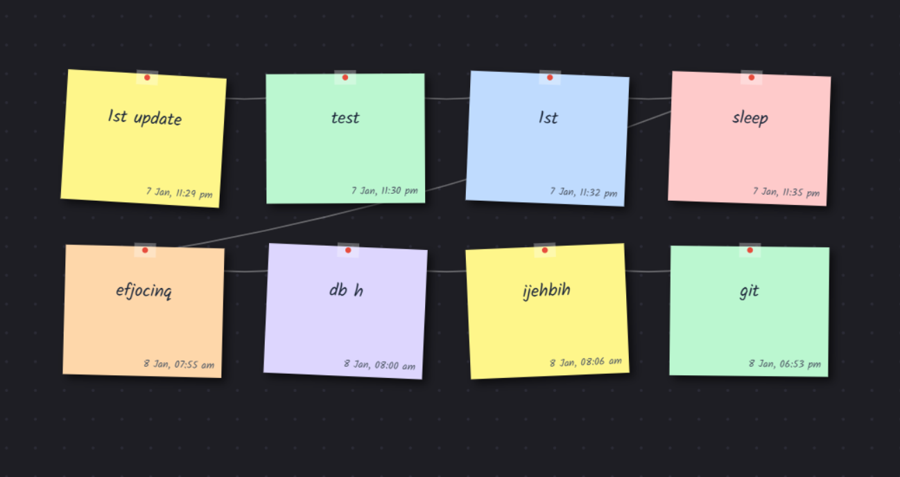
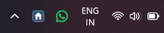

# BitVille - Activity & GitHub City Visualizer

BitVille is a gamified productivity application that transforms your daily computer activity and GitHub contributions into a living, breathing isometric city.

Every keystroke, mouse click, and commit helps your city grow!

> **Note**: This project is derived from [GitVille](https://github.com/Addressmehari/GitVille) by Addressmehari.

## 🏙️ What is BitVille?

BitVille runs in the background and tracks your activity to reward you with city elements:

- **Houses**: Earned by accumulating **Active Time** (working on your PC).
- **Trees**: Grown during **Idle Time** (when you take a break).
- **Upgrades**: Unlock terraces and aesthetic upgrades for your houses by typing (**Key Presses**).
- **Git Posts**: Pushing code to GitHub creates special "Git Post" buildings.

The city is rendered in a beautiful isometric view with day/night cycles, dynamic weather, and wandering NPCs.

## ✨ Features

- **Activity Tracking**: unobtrusively monitors active usage and idle time.
- **GitHub Integration**: Connects to your GitHub profile to track contributions in real-time.
- **Visualizer**:
  - Real-time isometric city generation.
  - Day/Night cycle synchronized with your local time.
  - "Construction Mode" showing progress towards your next building.
  - Interactive camera (pan/zoom).
- **Glass Input / Sticky Notes**: A floating window to jot down thoughts, which are saved and visualized as sticky notes on a virtual wall.
- **System Tray App**: easy access to all features via a system tray icon.
- **Customizable**: Adjust thresholds for rewards and your GitHub username in the Settings.

## 📂 Project Structure

- **`tray_app.py`**: The main entry point. Launches the system tray icon and manages the data collector.
- **`data_collector.py`**: The core logic engine. Tracks inputs, monitors GitHub, and calculates rewards.
- **`visualizer_app.py`**: Launches the main City Visualizer window.
- **`settings_window.py`**: A GUI for configuring application settings (Username, Thresholds).
- **`home/glass_window.py`**: The "Glass Input" application for sticky notes.
- **`visualizer/`**: Contains the frontend code (HTML/JS/CSS) and Python generation logic for the city representation.
- **`datas/`**: Stores your activity logs (`activity_log.json`).

## 🚀 How to Run

1. **Extract**:
   Download the release ZIP file and extract the contents into a **separate, dedicated folder**.
   _It is highly recommended to keep all files in one folder to ensure data is saved correctly._

2. **Run the App**:
   Locate and double-click the **`BitVille.exe`** application.

   _The application will start silently and minimize to your system tray immediately._

3. **Interact**:

   - **Right-click** the tray icon to:
     - **View Map**: Open the City Visualizer.
     - **View Stats**: Open the **Sticky Notes Wall** (Activity Feed) to view your saved notes.
     - **Settings**: Configure your GitHub username and difficulty.
     - **Open Input**: Open the floating window to create new sticky notes.

4. **⚠️ Important Note on Data**:
   The application creates data files (such as `datas/activity_log.json` and `settings.json`) to store your city's progress.
   **Do NOT delete these files** or move the executable out of the folder, otherwise you will lose your city and settings!

## ⚙️ Configuration

You can change the difficulty and settings via the **Settings -> Settings** menu in the tray app.

- **Github Username**: The profile to track for commits.
- **House Threshold**: Seconds of active time needed to build a house.
- **Tree Threshold**: Seconds of idle time needed to plant a tree.
- **Upgrade Threshold**: Number of key presses needed to upgrade a house.
- **Git Post Threshold**: Number of commits needed for a Git Building.

## 🛠️ Technology Stack

- **Python**: Backend logic, threading, and system integration.
- **PyWebview**: Wraps the HTML/JS visualizers into native-like windows.
- **HTML5 Canvas & JavaScript**: Renders the high-performance isometric city.
- **Pynput**: Low-level input monitoring.

---

## 📸 Gallery

  
  

  
  

---

_Build your city, one commit at a time._
